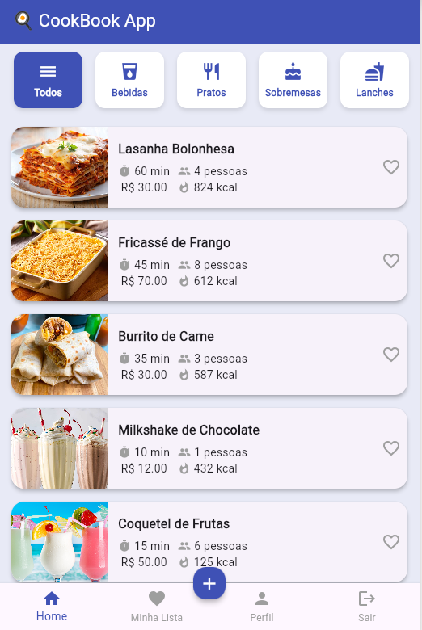
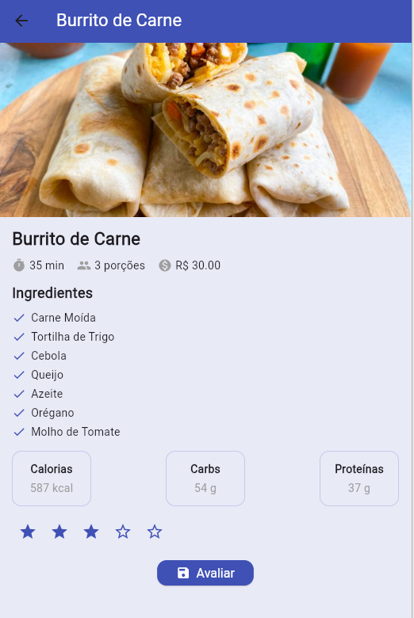
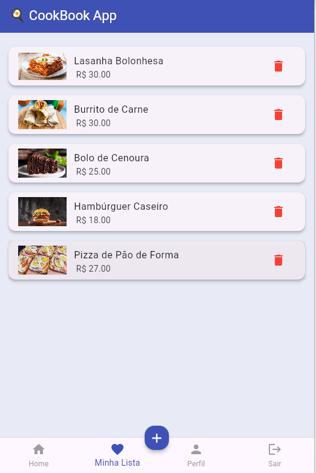
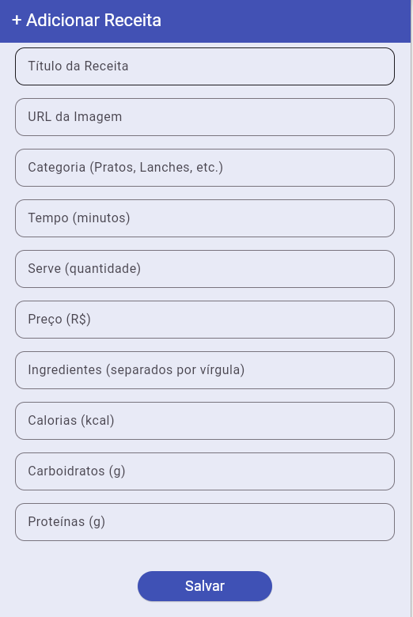

# 🍳 CookBook App

Um aplicativo Flutter simples e moderno para gerenciamento de receitas.  
O **CookBook App** permite visualizar, favoritar e explorar receitas categorizadas (Pratos, Bebidas, Lanches e Sobremesas), além de acessar um perfil e um template para adicionar novas receitas.

---

## 🚀 **Funcionalidades**

- 🏠 **Home:** exibe todas as receitas com filtro por categoria.  
- ❤️ **Minha Lista:** mostra as receitas favoritadas.  
- 👤 **Perfil:** exibe informações básicas do usuário com foto.  
- ➕ **Adicionar Receita:** botão central que leva a uma tela estática para criação de receitas.  
- 🚪 **Logout:** retorna para a tela de login.  
- 🔍 **Filtro por categoria:** selecione entre Bebidas, Pratos, Sobremesas e Lanches.  

---

## 🖼️ **Screenshots**

| Tela de Login | Tela Principal | Tela de Detalhamento |
|:--------------:|:---------------:|:---------------:|
|  |  |  

| Tela de Perfil | Favoritos | Adicionar Receita |
|:--------------:|:---------------:|:---------------:|
|  |  |  |

---

## 🧑‍💻 **Tecnologias Utilizadas**

- [Flutter](https://flutter.dev/) 💙  
- [Dart](https://dart.dev/)  
- [Shared Preferences](https://pub.dev/packages/shared_preferences)  
- [Material Design](https://m3.material.io/)

---

## ⚙️ **Como Executar**

1. Clone o repositório:
   git clone https://github.com/seu-usuario/cookbook_app.git
   
2. Instale o pacote SharedPreferences
   import 'package:shared_preferences/shared_preferences.dart';
   flutter pub add shared_preferences  
    - persistência de login com SharedPreferences.
    - Com isso, o usuário não precisa logar novamente toda vez que abrir o app, e o botão “Sair” limpa a sessão e o redireciona à tela de login.

## 🧠 Estrutura do Projeto
lib/
│
├── main.dart
├── models/
│   └── recipe.dart
├── data/
│   └── recipes_data.dart
├── screens/
│   ├── login_screen.dart
│   ├── bottom_nav.dart
│   ├── recipe_detail_screen.dart
│   └── add_recipe_screen.dart
└── widgets/
    └── nutrient_card.dart

