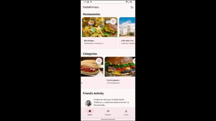

# ceub-dev-multiplataforma-2025

# Itadakimasu App Restaurante

Um protótipo de aplicativo em Flutter para descoberta de restaurantes e comidas. O projeto foi desenvolvido com foco em uma interface de usuário moderna, consumo de API e gerenciamento de estado local.

## Demonstração

## Funcionalidades Desenvolvidas no app

* **Listagem de Seções**: A tela principal exibe três seções:
    * Restaurantes (lista horizontal)
    * Categorias (lista horizontal)
    * Atividade de Amigos (lista vertical)

* **Alternância de Tema (Light/Dark)**: Um botão na `AppBar` permite ao usuário trocar instantaneamente entre o modo Claro (Light) e Escuro (Dark). O estado do tema é gerenciado no `main.dart` e passado para a `HomePage`.

* **Função de Favoritar**: Cada card de Restaurante e Categoria possui um ícone de coração funcional. Ao ser clicado, o estado do ícone muda (preenchido/vazio) e é salvo localmente no estado do próprio widget (`StatefulWidget`).

* **Design Moderno (Material 3)**: A interface utiliza componentes do Material 3, com foco em:
    * Espaçamento adequado (padding) nas seções e listas.
    * Cards com bordas arredondadas e sombras sutis.
    * Hierarquia de texto clara para títulos e subtítulos.

* **Consumo de API Otimizado**: O app busca os dados de uma API (Beeceptor) usando o pacote `http`. A chamada é feita **apenas uma vez** no `initState` da tela principal, evitando requisições desnecessárias a cada redesenho da tela.

## 🛠️ Tecnologias Utilizadas

* **Flutter (SDK)**: Framework principal para o desenvolvimento da interface.
* **Dart**: Linguagem de programação.
* **Material 3**: Biblioteca de design utilizada (`useMaterial3: true`).
* **`http` (pacote)**: Para realizar as requisições GET à API.
* **`FutureBuilder`**: Para construir a UI de forma assíncrona após o retorno da API.
* **`StatefulWidget`**: Para gerenciamento de estado local (tema e favoritos).