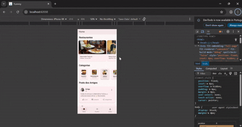

# App Restaurant

Este projeto segue uma arquitetura bem estruturada com separação clara de responsabilidades:

Primeiro, atualizei o `MockService` para consumir os três endpoints fornecidos

Criei o `CategoriesComponent` como um widget reutilizável:

Criei o `PostsComponent` para exibir posts de amigos

Implementei uma função inteligente para formatar timestamps:

Endpoints Utilizados

1. **Restaurantes**: `https://68f68cfa6b852b1d6f171151.mockapi.io/app-restaurant/restaurants`
2. **Categorias**: `https://68f68cfa6b852b1d6f171151.mockapi.io/app-restaurant/categories`
3. **Posts**: `https://mocki.io/v1/08b9dad6-230d-42ff-a0cf-85377abcb6f2`

